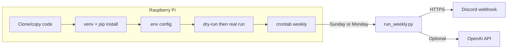

# Raspberry Pi setup walkthrough

Step-by-step guide to run the weekly digest on a Raspberry Pi so it runs automatically (e.g. Sunday 18:00 or Monday 07:00).

---

## Prerequisites on the Pi

- **Raspberry Pi OS** (or any Debian-based Linux) with network access.
- **Python 3.10+** – Raspberry Pi OS Bookworm often has 3.11. Check with:
  ```bash
  python3 --version
  ```
  If you have 3.9 or older, install 3.10+ (e.g. `sudo apt install python3.11 python3.11-venv`) or use [pyenv](https://github.com/pyenv/pyenv) / [deadsnakes PPA](https://launchpad.net/~deadsnakes/+archive/ubuntu/ppa) if you use Ubuntu.
- **Git** (to clone the repo): `sudo apt install git`

---

## 1. Get the code onto the Pi

**Option A – Clone from Git (if you use a repo):**

```bash
cd ~
git clone <your-repo-url> family-bot
cd family-bot
```

**Option B – Copy from your Mac (no Git):**

- Zip the project on your Mac (exclude `.venv` and `__pycache__`), copy to the Pi via SCP, USB, or shared folder, then unzip and `cd` into the project directory on the Pi.

---

## 2. Create virtualenv and install dependencies

From the project directory on the Pi:

```bash
cd ~/family-bot   # or your path
python3 -m venv .venv
source .venv/bin/activate
pip install --upgrade pip
pip install -r requirements.txt
```

This installs: `httpx`, `beautifulsoup4`, `icalendar`, `recurring-ical-events`, `openai` (see `requirements.txt`).

---

## 3. Configure environment variables

- Copy the example env file:
  ```bash
  cp .env.example .env
  ```
- Edit `.env` with your values (use `nano .env` or another editor). Minimum:
  - **DISCORD_WEBHOOK_URL** – Required. Create in Discord: Channel → Integrations → Webhooks → New Webhook, then paste the URL.
  - **PERSON_SCHOOL** – Required. Format: `Name|ClassLabel|URL` per person, comma-separated (e.g. `Olle|8B|https://...,Elsa|6B|https://...`).
- Optional but recommended:
  - **PERSON_CALENDARS** – `Names|ICS_URL` (e.g. `Familjen|webcal://...`). Use name "Familjen" for shared family calendar.
  - **OPENAI_API_KEY** and **USE_LLM_EXTRACTION=1** – For LLM-generated digest (single API call per week).
  - **CALENDAR_TIMEZONE** – e.g. `Europe/Stockholm` (default).

The app loads `.env` from the current working directory when you run the script (`config.py`), so cron must run from the project directory.

---

## 4. Test the run (no Discord send)

With the venv activated:

```bash
source .venv/bin/activate
python run_weekly.py --dry-run
```

- Digest is written to `digest_preview.txt`. Open it to confirm school and calendar content look correct.
- If you use the LLM, you should see `Using model: ...` on stderr.
- If something fails (e.g. missing `OPENAI_API_KEY` or `openai`), the script prints a short message to stderr and falls back to the template digest.

Then do a **real send** once to verify Discord:

```bash
python run_weekly.py
```

Check that the Discord channel receives the message.

---

## 5. Set timezone (optional but recommended)

So "next week" and calendar times match your timezone:

```bash
sudo raspi-config
# → Localisation Options → Timezone → choose your zone (e.g. Europe/Stockholm)
```

Or:

```bash
sudo timedatectl set-timezone Europe/Stockholm
```

---

## 6. Schedule weekly run and weekday updates with cron

Cron runs in a minimal environment (no venv activated, no `.env` from your shell). Use the **full path to the venv Python** and run from the **project directory** so `config.py` finds `.env`:

```bash
crontab -e
```

Add lines (adjust `/home/pi/family-bot` to your actual path):

**Sunday 18:00 – full digest and save snapshot:**

```cron
0 18 * * 0  cd /home/pi/family-bot && .venv/bin/python run_weekly.py
```

**Weekdays 07:00 – check for updates and notify if anything changed:**

```cron
0 7 * * 1-5  cd /home/pi/family-bot && .venv/bin/python run_weekly.py --check-updates
```

- Sunday: builds the digest for the coming week, sends it to Discord, and stores a snapshot in `.digest_snapshots/`.
- Weekdays: fetches school and calendar again, compares with the stored snapshot; if there are new school or calendar updates, sends a short notification to Discord and updates the snapshot. If nothing changed, nothing is sent.
- `cd ... &&` ensures the script runs with the project as current directory so `.env` is loaded.
- `.venv/bin/python` uses the venv that has all dependencies; no `source` needed.

Save and exit.

---

## 7. Verify cron and logs

- List your crontab: `crontab -l`
- After the first scheduled run, check that a new message appeared in Discord.
- To capture errors, you can redirect stderr to a log file in the crontab line, for example:
  ```cron
  0 18 * * 0  cd /home/pi/family-bot && .venv/bin/python run_weekly.py >> /home/pi/family-bot/cron.log 2>&1
  ```
  Then inspect `cron.log` if the digest does not appear.

---

## Summary flow



**Quick checklist:** Python 3.10+, clone/copy project → `python3 -m venv .venv` → `source .venv/bin/activate` → `pip install -r requirements.txt` → `cp .env.example .env` and edit → `python run_weekly.py --dry-run` → `python run_weekly.py` → `crontab -e` with `cd /path/to/family-bot && .venv/bin/python run_weekly.py` at desired time.
