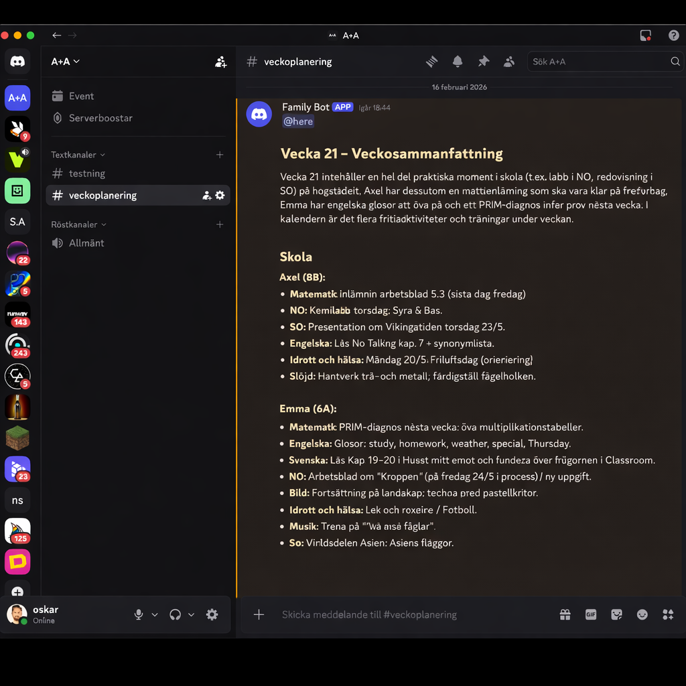
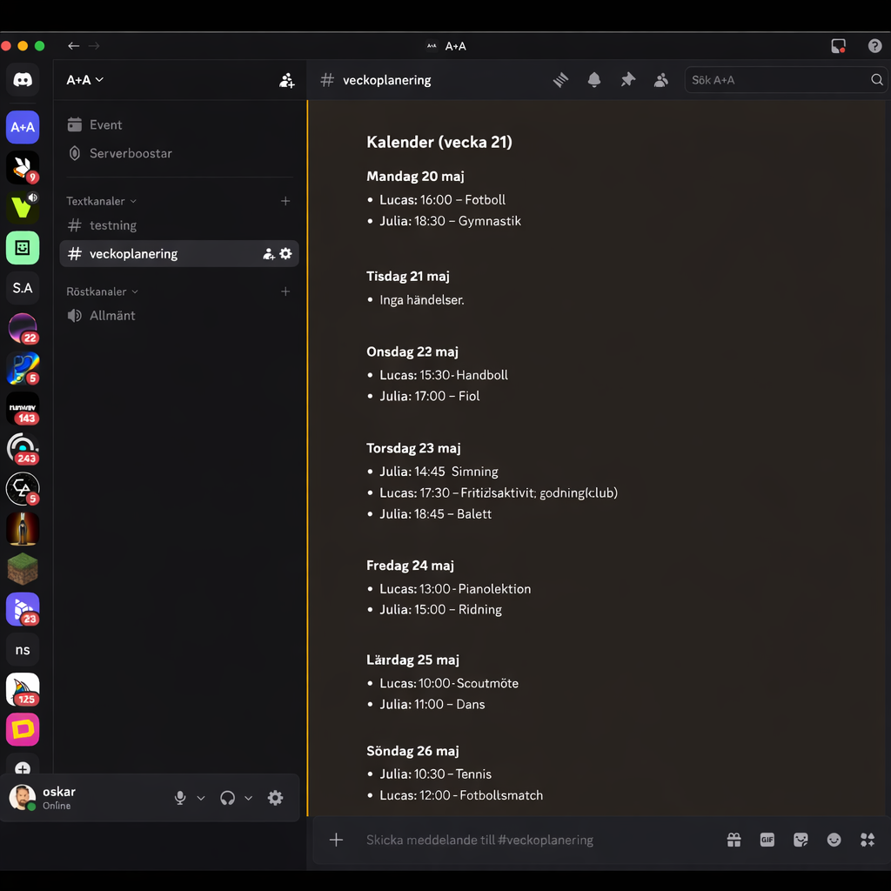

# Weekly digest bot

En bot som varje vecka sammanställer skolinfo (klassidor du konfigurerar) och kalenderhändelser (t.ex. iCloud via ICS) och skickar en sammanfattning till Discord.

## Screenshots (anonymiserade via AI)



## Krävs

- Python 3.10+
- Discord-webhook-URL för en kanal
- En eller flera ICS-prenumerationslänkar till kalendrar (valfritt)

## Installation

```bash
cd /path/to/family-bot
python -m venv .venv
source .venv/bin/activate   # Windows: .venv\Scripts\activate
pip install -r requirements.txt
```

## Konfiguration

Kopiera `.env.example` till `.env` och fyll i värdena. **Committa aldrig `.env`** – filen innehåller webhook-URL, kalenderlänkar och eventuellt skol-URL:er och är redan listad i `.gitignore`.

```bash
cp .env.example .env
```

- **DISCORD_WEBHOOK_URL** – Skapa en Incoming Webhook i Discord: Kanalinställningar → Integrations → Webhooks → New Webhook, kopiera URL.
- **PERSON_SCHOOL** – Person + klass: format `Name|ClassLabel|URL`, kommaseparerat. T.ex. `Alice|6B|https://...,Bob|8B|https://...`. Namn och klassetikett (6B, 8B) är konfigurerbara; byt vid behov när klasser/år ändras.
- **SPECIAL_INFO_&lt;Name&gt;** – Valfritt. Per-person notiser (t.ex. ämnesbyten: "Franska, Tyska (har Spanska istället)"). Namnet ska matcha PERSON_SCHOOL; nyckeln är SPECIAL_INFO_ + namnet i versaler med mellanslag ersatta med understreck (t.ex. `SPECIAL_INFO_OLLE=...`). Visas i digesten som en notis – filtrerar inget i sig.
- **SUPPRESS_SUBJECTS_&lt;Name&gt;** – Valfritt. Kommaseparerad lista med ämnen som ska uteslutas helt ur personens Skola-avsnitt (t.ex. ett ämne de inte läser), matchas skiftlägesokänsligt mot "Ämne"-kolumnen i veckoplaneringen. Samma namnformat som SPECIAL_INFO. T.ex. `SUPPRESS_SUBJECTS_OLLE=Franska,Tyska`.
- **PERSON_CALENDARS** – Valfritt. Kalender kopplad till person(er): format `Names|ICS_URL`. `Names` är ett namn eller flera med `;` (t.ex. `Alice;Bob` = kalender för båda). Samma person kan ha flera kalendrar genom flera rader. Digesten grupperar händelser per person.
- **ICS_URLS** – Valfritt (fallback). Global kalender om PERSON_CALENDARS inte är satt. Kommaseparerade ICS-URL:er.
- **ANTHROPIC_API_KEY** – Valfritt. Om satt skickas skol- och kalenderdata till Claude som skriver hela veckosammanfattningen (rubrik, inledning, Skola, Kalender). Kräver `pip install anthropic`. Skaffa en nyckel på [console.anthropic.com](https://console.anthropic.com) (separat från en claude.ai Pro/Max-prenumeration – det här debiteras per token). Modell: **ANTHROPIC_DIGEST_MODEL** (standard: `claude-sonnet-5`).
- **CALENDAR_TIMEZONE** – Valfritt. Tidszon för kalenderveckan och händelsetider (t.ex. Europe/Stockholm). Standard: Europe/Stockholm.

**Kalender:** Händelser hämtas för nästa veckas måndag–söndag (samma vecka som skolinfo). I digesten visas kalendern **dag för dag**: under varje veckodag (t.ex. "Måndag 17 februari") listas vad varje person har den dagen, inklusive skolprov (se nedan). Om du har en kalender med namnet **Familjen** (t.ex. `Familjen|webcal://...`) tolkas den som att hela familjen gör något tillsammans; det nämns i veckosammanfattningen högst upp.

**Skola:** `school.py` förväntar sig en Google Sites-klassida som länkar vidare till två Google Docs: ett **provschema** (terminslångt, delat mellan syskonens klasser) och en **veckoplanering** (klass-specifik, en tabell per vecka). Båda hämtas anonymt via Google Docs export och parsas som strukturerade tabeller – inget regelbaserat textfilter behövs längre. Provscheman ger daterade prov som läggs in i kalendern dag-för-dag; veckoplaneringen ger ämnesvis planering/läxor under Skola-rubriken. Om veckoplaneringen inte hunnit uppdateras för målveckan visas det tydligt i digesten istället för att tyst visa fel veckas innehåll. Om ANTHROPIC_API_KEY är satt skriver Claude hela digesten utifrån den extraherade datan, annars används mallen (`build_digest`).

Om du publicerar repot: alla känsliga och hemspecifika värden ska ligga i `.env`. Committa bara `.env.example` (utan riktiga värden). Kontrollera att `.env` finns i `.gitignore`.

## Köra manuellt

```bash
python run_weekly.py
```

Om `DISCORD_WEBHOOK_URL` inte är satt skrivs digesten ut i stderr och skriptet avslutar med felkod 1.

**För att granska och justera filtreringen** (skickas inte till Discord):

```bash
python run_weekly.py --dry-run
```

Digesten sparas i `digest_preview.txt`. Öppna filen, granska innehållet, ändra t.ex. `school.py` (veckofilter, ämnesrubriker) eller `llm_improve.py` (LLM-prompt) och kör `--dry-run` igen tills resultatet är bra. Annat filnamn: `python run_weekly.py --dry-run -o min_preview.txt`.

**Skriv ut en viss vecka:** `python run_weekly.py --dry-run --week 8` ger digest för ISO vecka 8 (nuvarande år). Använd `--year 2025` för ett visst år, t.ex. `python run_weekly.py --dry-run -w 10 -y 2025`.

## Schemaläggning med cron

**Söndag:** Kör full veckosammanfattning (nästa vecka), skicka till Discord och spara en ögonblicksbild (snapshot) av data. **Vardagar (valfritt):** Kör `run_weekly.py --check-updates` – hämtar data igen, jämför med sparad ögonblicksbild; om något nytt (skola eller kalender) skickas en kort notis till Discord och ögonblicksbilden uppdateras.

```bash
crontab -e
```

Lägg till (ändra sökväg till din installation):

```cron
# Söndag 18:00 – veckosammanfattning + spara snapshot
0 18 * * 0  cd /path/to/family-bot && .venv/bin/python run_weekly.py

# Vardagar 07:00 – kolla uppdateringar, skicka notis vid ändringar
0 7 * * 1-5  cd /path/to/family-bot && .venv/bin/python run_weekly.py --check-updates
```

Alternativt bara söndag (utan vardagsnotiser):

```cron
0 18 * * 0  cd /path/to/family-bot && .venv/bin/python run_weekly.py
```

Se till att cron har tillgång till samma miljö om du använder `.env` (kör från projektdirectory så att `config.py` hittar `.env`). För steg-för-steg-installation på en Raspberry Pi, se [RASPBERRY_PI.md](RASPBERRY_PI.md).

## Projektstruktur

- `config.py` – Läser URL:er och webhook från miljö/`.env`
- `school.py` – Hämtar klassidan, hittar länkarna till provschema/veckoplanering (Google Docs), och parsar dem som strukturerade tabeller för målveckan
- `cal_fetcher.py` – Hämtar ICS för måndag–söndag i målveckan, händelser per person; återkommande händelser (RRULE) expanderas till varje förekomst (kräver `recurring-ical-events`)
- `digest.py` – Bygger meddelandet (skola + kalender dag för dag)
- `llm_improve.py` – Valfritt: skickar skol- och kalenderdata till Claude, som skriver hela veckosammanfattningen (kräver ANTHROPIC_API_KEY)
- `discord_notify.py` – Skickar till Discord via webhook
- `run_weekly.py` – Entry point för cron; `--check-updates` för vardagsdiff och notis
- `snapshot.py` – Sparar och jämför veckodata (söndag = spara, vardag = diff + notis vid ändringar)
